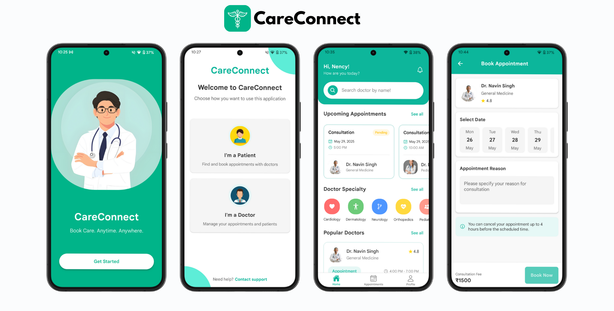
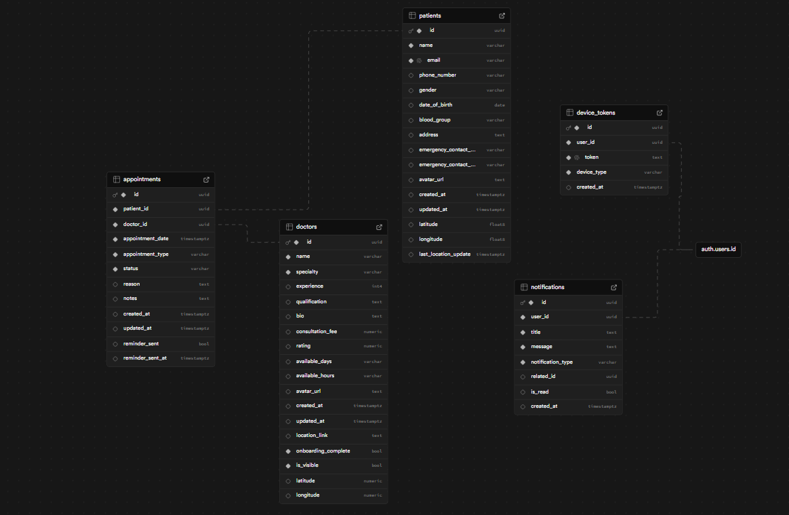
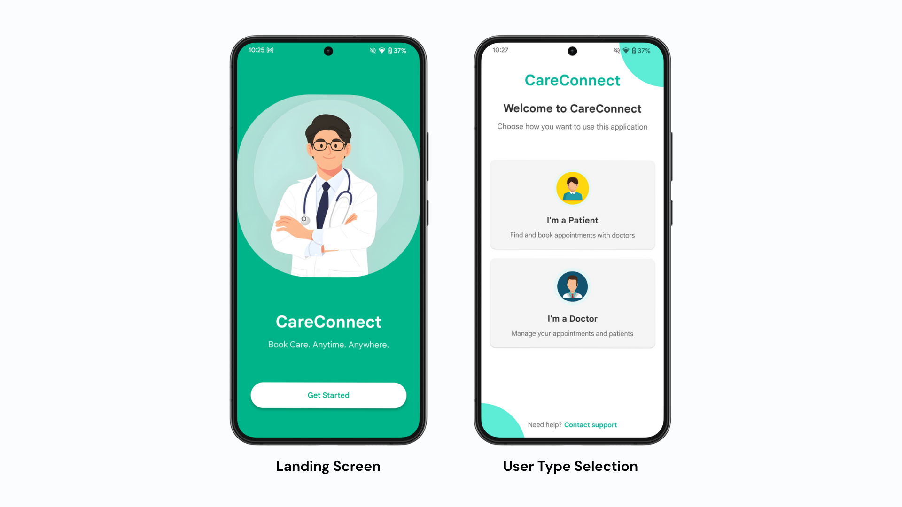
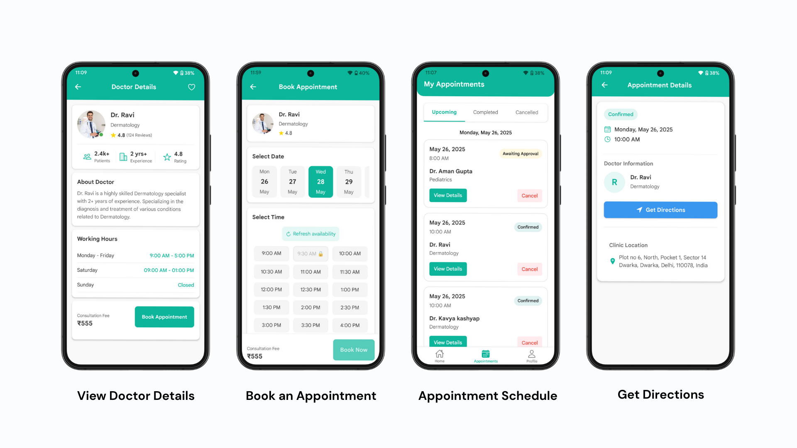
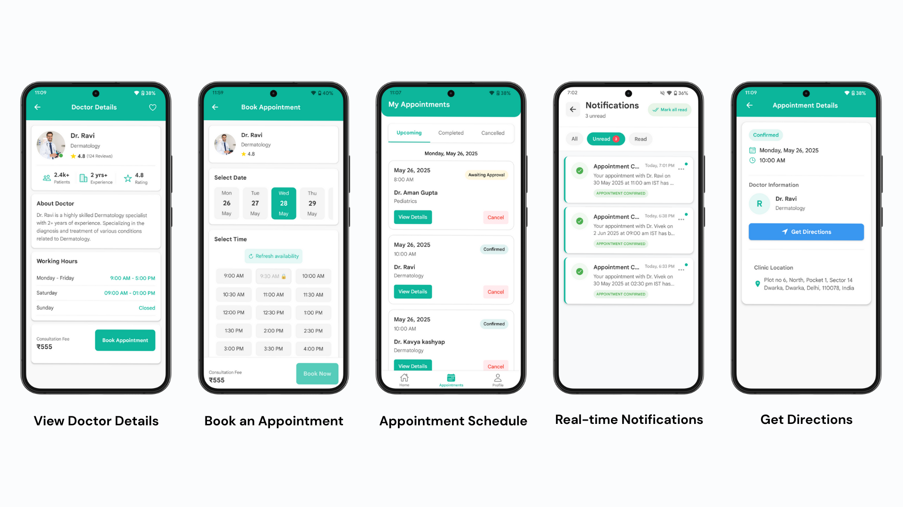
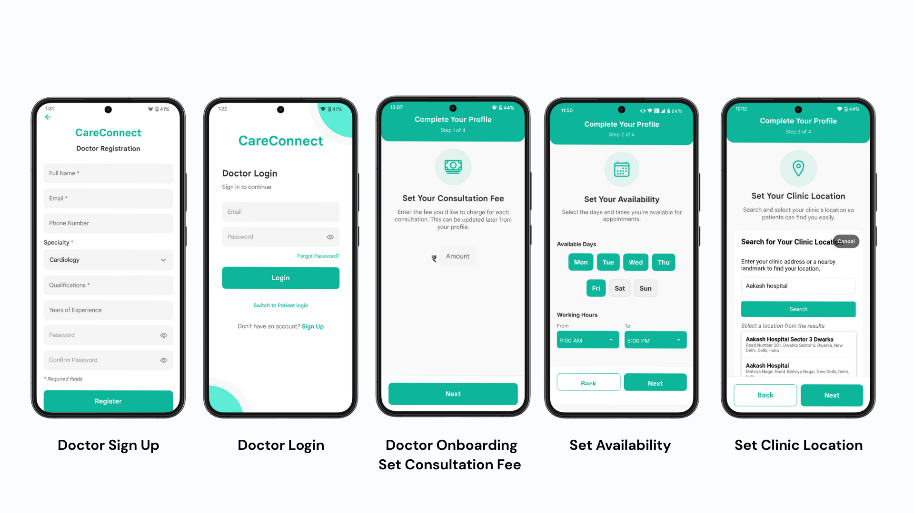
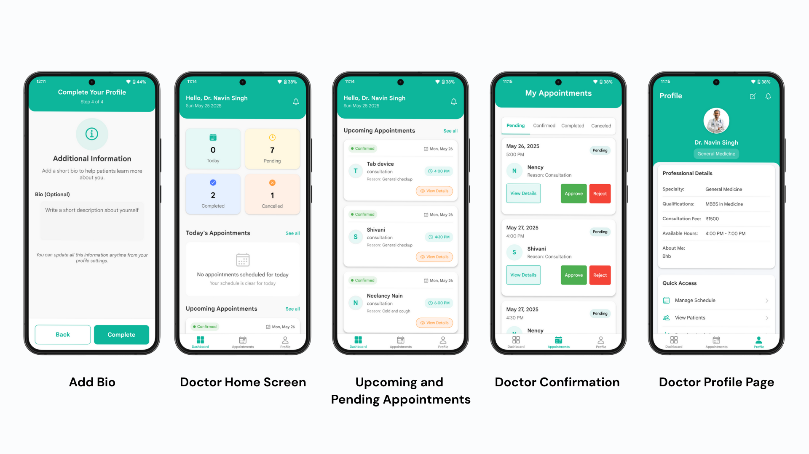
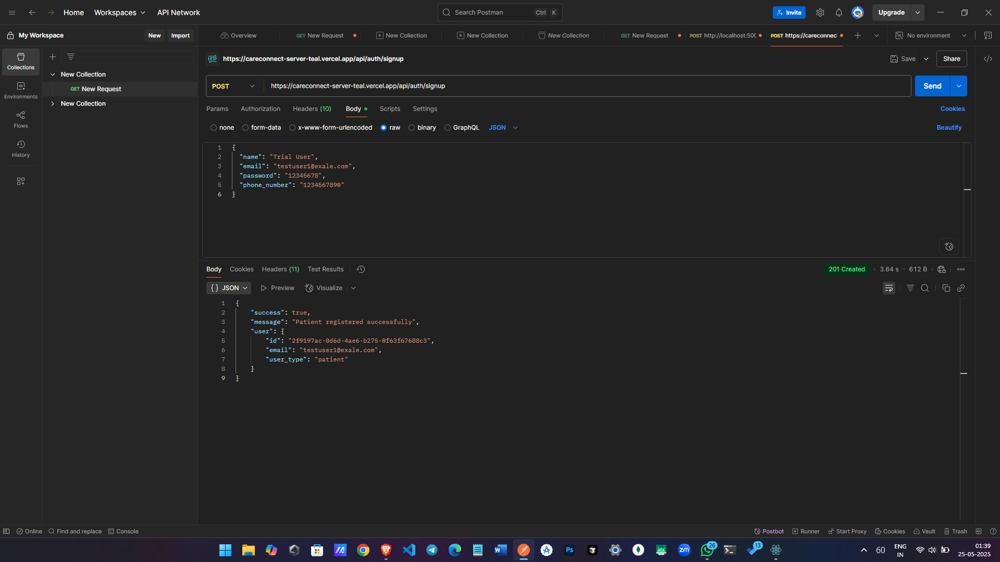
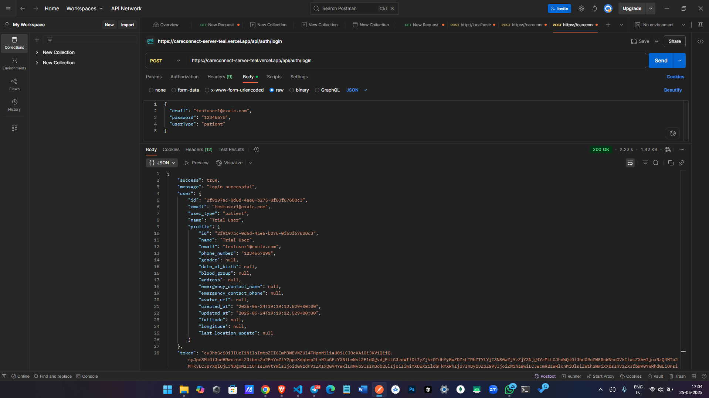

# CareConnect 



**By team TechTribe**

CareConnect is a user-friendly mobile application built with React Native that bridges the gap between patients and healthcare providers. The platform enables patients to discover doctors, schedule appointments, and manage their healthcare journey, while providing doctors with tools to efficiently manage their practice and patient interactions.

This project has been developed as a submission for the Veersa Hackathon, addressing Use Case 3: a mobile application for scheduling appointments between patients and doctors.

**Server Repo** - https://github.com/sahildevil/careconnect_server 

**Figma:** - https://www.figma.com/design/dumfvVWw44B3CGGGFZJsPE/CareConnect?node-id=0-1&t=ePAsApcBFMhyXNAY-1

**APK:** - https://drive.google.com/drive/folders/1IdTUlCvwAt6oYTvxSbs4811QhExKpdxK?usp=sharing

**Web Version Repo** - https://github.com/anchal6904/careconnect

## ✨ Features

### 🧑‍⚕️ For Patients

- **Doctor Discovery**
  - Search for doctors by name or specialty
  - Filter by location, fees, distance, and experience
  - Sort doctors by distance, fees, or experience

- **Appointment Booking**
  - Schedule appointments with preferred doctors
  - Select convenient time slots
  - No Clash between multiple slot booking
  - Track appointment status and history

- **Healthcare Management**
  - Receive Push notifications for appointment status update
  - Reminders for upcoming appoinments

### 👨‍⚕️ For Doctors

- **Professional Profile Management**
  - Set consultation fees and availability hours

- **Appointment Dashboard**
  - View daily schedule and upcoming appointments
  - Track pending appointment requests
  - Manage patient information and visit history
  - Accept or decline appointment requests
  - Complete appointments and maintain records

## 🛠️ Technology Stack

### Frontend
- **React Native** - Cross-platform mobile framework
- **React Navigation** - Navigation and routing
- **React Context API** - State management
- **Axios** - API requests handling
- **React Native Geolocation** - Location services

### Backend
- **Node.js & Express** - Server infrastructure
- **Supabase** - PostgreSQL database
- **Push Notification** - Firebase Cloud Messaging
- **REST API** - API architecture

## 🛠️ Data Model 


## 📱 Screenshots







## 📽️ Demo Video
<a href="https://res.cloudinary.com/dncukx7es/video/upload/v1748187038/VN20250525_205059_zcdupi.mp4" target="_blank">
  
</a>

## 🧩 Project Structure

```
careconnect/
├── src/
│   ├── assets/           # Images, icons, and fonts
│   ├── components/       # Reusable UI components
│   ├── context/          # React context providers
│   ├── navigation/       # Navigation configuration
│   ├── screens/
│   │   ├── auth/         # Authentication screens
│   │   ├── doctor/       # Doctor-specific screens
│   │   └── patient/      # Patient-specific screens
│   │   └── shared/       # Shared screens
│   ├── services/         # API services
│   └── utils/            # Helper functions
```

## 📋 Future Scope

- [ ] Video consultation feature
- [ ] In-app messaging between doctors and patients
- [ ] Health records integration
- [ ] Payment processing integration
- [ ] Multi-language support

## 💻 Testing
<table>
  <tr>
    <td></td>
    <td></td>
  </tr>
  <tr>
    <td>Sign Up API test</td>
    <td>Login API test</td>
  </tr>
</table>

## Authors

- [@sahildevil](https://github.com/sahildevil)
- [@Neelancy1504](https://github.com/Neelancy1504)

---

<p align="center">Made with ❤️ for better healthcare access</p>
