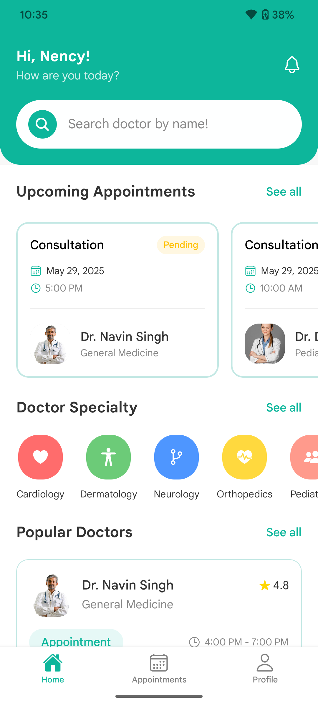

# CareConnect


A comprehensive healthcare platform connecting patients with doctors for seamless appointment booking and medical consultations.

## 🏥 About

CareConnect is a user-friendly mobile application built with React Native that bridges the gap between patients and healthcare providers. The platform enables patients to discover doctors, schedule appointments, and manage their healthcare journey, while providing doctors with tools to efficiently manage their practice and patient interactions.

## ✨ Features

### 👨‍⚕️ For Doctors

- **Professional Profile Management**
  - Create and customize detailed professional profiles
  - Showcase qualifications, experience, and specialties
  - Set consultation fees and availability hours

- **Appointment Dashboard**
  - View daily schedule and upcoming appointments
  - Track pending appointment requests
  - Manage patient information and visit history

- **Practice Management**
  - Accept or decline appointment requests
  - Complete appointments and maintain records
  - View practice statistics and insights

### 🧑‍⚕️ For Patients

- **Doctor Discovery**
  - Search for doctors by name or specialty
  - Filter by location, fees, distance, and experience
  - View comprehensive doctor profiles with ratings

- **Smart Filtering**
  - Sort doctors by distance, fees, or experience
  - Filter based on consultation fees range
  - Find doctors within specific distance radius

- **Appointment Booking**
  - Schedule appointments with preferred doctors
  - Select convenient time slots
  - Track appointment status and history

- **Healthcare Management**
  - Receive notifications for upcoming appointments
  - Access medical advice and consultation services
  - Manage personal health information

## 🛠️ Technology Stack

### Frontend
- **React Native** - Cross-platform mobile framework
- **React Navigation** - Navigation and routing
- **React Context API** - State management
- **Axios** - API requests handling
- **React Native Vector Icons** - UI icons library
- **React Native Geolocation** - Location services

### Backend
- **Node.js & Express** - Server infrastructure
- **Supabase** - PostgreSQL database
- **JWT Authentication** - Secure authentication
- **REST API** - API architecture

## 📱 Screenshots

<table>
  <tr>
    <td></td>
    <td></td>
    <td></td>
  </tr>
  <tr>
    <td></td>
    <td></td>
    <td></td>
  </tr>
</table>

## 🚀 Getting Started

### Prerequisites
- Node.js (v16+)
- npm or Yarn
- React Native development environment
- Android Studio or Xcode for mobile development

### Installation

1. **Clone the repository**
   ```bash
   git clone https://github.com/yourusername/careconnect.git
   cd careconnect
   ```

2. **Install dependencies**
   ```bash
   npm install
   ```

3. **iOS Setup (if targeting iOS)**
   ```bash
   cd ios && pod install && cd ..
   ```

4. **Start the application**
   ```bash
   # Start Metro bundler
   npm start

   # Run on Android
   npm run android

   # Run on iOS
   npm run ios
   ```

## 🧩 Project Structure

```
careconnect/
├── src/
│   ├── assets/           # Images, icons, and fonts
│   ├── components/       # Reusable UI components
│   ├── context/          # React context providers
│   ├── navigation/       # Navigation configuration
│   ├── screens/
│   │   ├── auth/         # Authentication screens
│   │   ├── doctor/       # Doctor-specific screens
│   │   └── patient/      # Patient-specific screens
│   ├── services/         # API services
│   └── utils/            # Helper functions
```

## 🤝 Contributing

1. Fork the repository
2. Create your feature branch (`git checkout -b feature/amazing-feature`)
3. Commit your changes (`git commit -m 'Add some amazing feature'`)
4. Push to the branch (`git push origin feature/amazing-feature`)
5. Open a Pull Request

## 📋 Roadmap

- [ ] Video consultation feature
- [ ] In-app messaging between doctors and patients
- [ ] Health records integration
- [ ] Payment processing integration
- [ ] Multi-language support

## 📄 License

This project is licensed under the MIT License - see the LICENSE file for details.

## 📬 Contact

Neelam Gupta - [yourname@email.com](mailto:yourname@email.com)

Project Link: [https://github.com/yourusername/careconnect](https://github.com/yourusername/careconnect)

---

<p align="center">Made with ❤️ for better healthcare access</p>